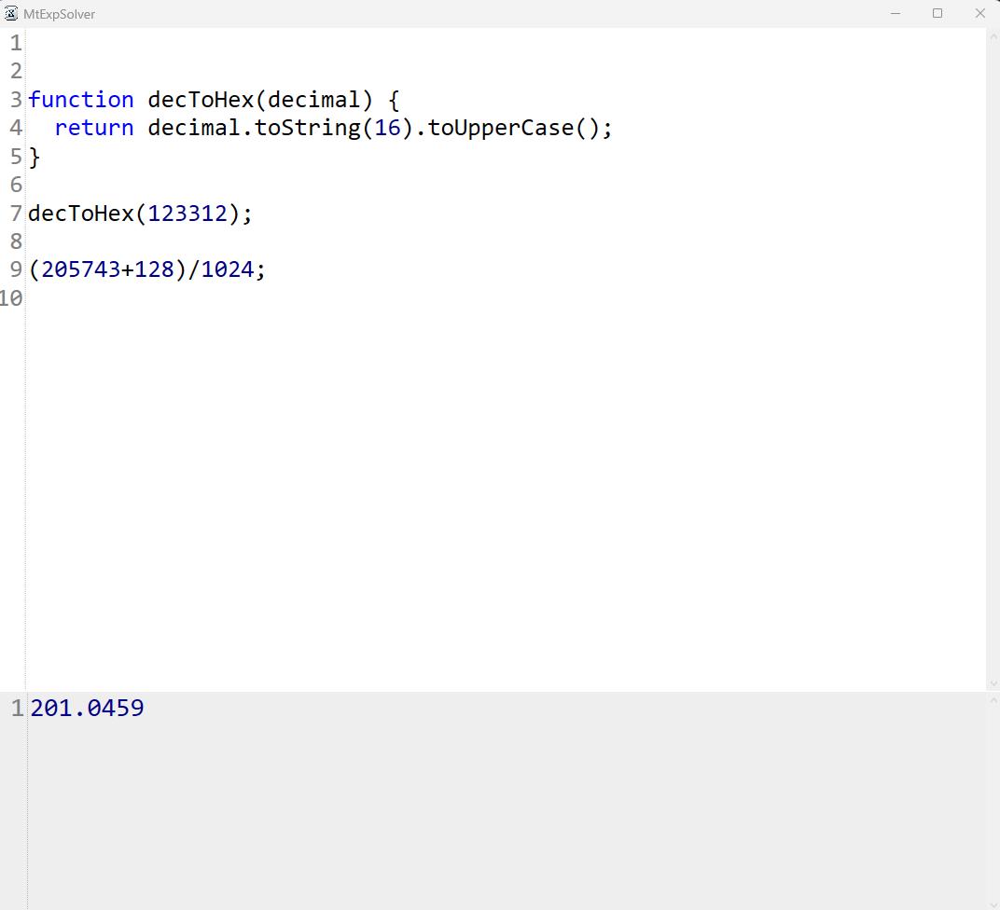

# MtExpSolver

MtExpSolver is not just an ordinary calculator — it uses a **JavaScript engine** to evaluate expressions and scripts.  
The last line of your script is treated as the **result**.



## Features

- Input area at the top where you can type what needs to be calculated.  
- Line numbers for every row of the input script.  
- The result (or error) is shown in the output box below the input.  
- Automatic recalculation shortly after you change the input text.  
- Supports **all available JavaScript syntax** for calculations.  
- Built-in protection: if a script does not terminate within a short time, an error is displayed (the app is designed for calculations, not for running endless scripts).  
- Current script is saved automatically in the user’s **Windows Roaming configuration directory**.  
- Custom script files with the extension `.MtExpSolver` can be created and opened.  

## Example Use

You can type any valid JavaScript expression, such as:

````js
2 + 2
````

Result:

````text
4
````

Or use more advanced JavaScript features:

````js
let sum = 0;
for (let i = 1; i <= 100; i++) sum += i;
sum
````

Result:

````text
5050
````

